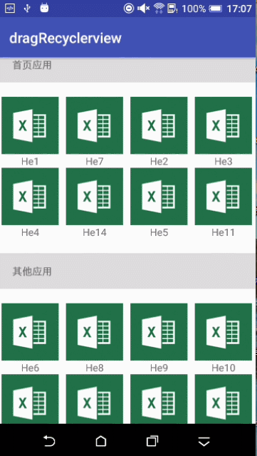

## RecyclerView 与 ItemTouchHelper 实现拖拽效果
## 截图

## 需求
- ```App``` 开发新的需求，要求 ```RecyclerView``` 实现的九宫格样式可以拖拽，松手以后变更位置，类似于手机桌面拖动 ```app``` 变更位置。
## 分析
- 经过搜索，发现 ```support``` 中带有一个类 ```ItemTouchHelper```,位于 ```android.support.v7.widget.helper.ItemTouchHelper```，通过操作该类可以实现需求类似的功能
- ```ItemTouchHelper``` 唯一构造方法源码：
```java
    /**
    * Creates an ItemTouchHelper that will work with the given Callback.
     * <p>
     * You can attach ItemTouchHelper to a RecyclerView via
     * {@link #attachToRecyclerView(RecyclerView)}. Upon attaching, it will add an item decoration,
     * an onItemTouchListener and a Child attach / detach listener to the RecyclerView.
     *
     * @param callback The Callback which controls the behavior of this touch helper.
     * 
     * 大概意思是：创建 ItemTouchHelper 并传入 Callback。通过方法 attachToRecyclerView(RecyclerView) 把 ItemTouchHelper 附加到 RecyclerView  上，通过装饰器模式，把 RecyclerView 的触摸操作分发给 Callback 。Callback 是一个抽象类，通过实现该类的某些方法，完成一些手势操作。
     *
     * @param callback  Callback 控制触摸操作
     */
    public ItemTouchHelper(Callback callback) {
        mCallback = callback;
    }

```
- 通过注释可以看到针对 RecyclerView  item 的操作可以由继承 Callback 类的方法来实现。```Callback``` 是一个静态内部抽象类 ，通过继承该类，在相应的方法中实现拖拽操作。
- ```Callback``` 主要方法：
    - getMovementFlags(RecyclerView recyclerView,
                ViewHolder viewHolder)：返回一个组合 flag ,该 flag 可以表示每个状态(idle,swiping,dragging)默认的可以移动的方向。可以使用 makeMovementFlags() 方法来代替手写复合 flag。 
    - makeMovementFlags(int dragFlags, int swipeFlags)：创建手势 flag 的方法，通过调用 makeFlag() 实现的。参数：通过传入参数实现 item 的拖拽，或滑动等操作
    - onMove(RecyclerView recyclerView,
                ViewHolder viewHolder, ViewHolder target)：拖拽的回调方法，实现该方法实现拖拽效果
    - isLongPressDragEnabled()：是否可以长按拖拽，默认返回 true ，表示支持长按拖拽；返回 false ，表示不支持长按拖拽。在针对具体业务中，有些 item 是不允许拖拽的，可以默认返回 false ，然后结合业务，在需要拖拽的地方，再操作。
    - isItemViewSwipeEnabled()：是否支持滑动。
    - onSwiped(ViewHolder viewHolder, int direction)：滑动回调方法，可以实现左滑和右滑等操作。
    - onSelectedChanged(ViewHolder viewHolder, int actionState)：滑动或者拖拽的 item 的选中状态，必须调用 super 方法。
    - clearView(RecyclerView recyclerView, ViewHolder viewHolder)：：完成滑动或者拖拽的动作以后的清理工作，必须调用 super 方法。

## 实现
- 主要代码：
```java
        itemTouchHelper = new ItemTouchHelper(new Callback() {
            /**
             * 设置是否滑动，拖拽方向，需要判断布局结构。GridLayoutManger 上下拖动， LineayLayoutManager 上下左右都可以拖动
             */
            @Override
            public int getMovementFlags(RecyclerView recyclerView, ViewHolder viewHolder) {
                if (recyclerView.getLayoutManager() instanceof GridLayoutManager) {
                    int dragFlags =
                            ItemTouchHelper.UP | ItemTouchHelper.DOWN | ItemTouchHelper.LEFT | ItemTouchHelper.RIGHT;
                    int swipeFlags = 0;
                    return makeMovementFlags(dragFlags, swipeFlags);
                } else if (recyclerView.getLayoutManager() instanceof LinearLayoutManager) {
                    int dragFlags = ItemTouchHelper.UP | ItemTouchHelper.DOWN;
                    int swipeFlags = ItemTouchHelper.LEFT | ItemTouchHelper.RIGHT;
                    return makeMovementFlags(dragFlags, swipeFlags);
                }
                return 0;
            }

            /**
             * 拖动的时候回调的方法，在这里需要将正在拖拽的 item 和集合的 Item 进行交换数据，然后通知 adapter 更新数据
             */
            @Override
            public boolean onMove(RecyclerView recyclerView, ViewHolder viewHolder, ViewHolder target) {
                int fromPosition = viewHolder.getAdapterPosition();
                int targetPosition = target.getAdapterPosition();
                DragBean dragBean = mList.get(fromPosition);
                mList.remove(fromPosition);
                mList.add(targetPosition, dragBean);
                dragAdapter.notifyItemMoved(fromPosition, targetPosition);
                return true;
            }

            /**
             * 滑动调用的方法，
             */
            @Override
            public void onSwiped(ViewHolder viewHolder, int direction) {
                int position = viewHolder.getAdapterPosition();
                mList.remove(position);
                dragAdapter.notifyItemRemoved(position);
            }

            /**
             * 长按的时候选中的 item, 给当前 item 设置一个高亮背景色
             */
            @Override
            public void onSelectedChanged(ViewHolder viewHolder, int actionState) {
                if (actionState != ItemTouchHelper.ACTION_STATE_IDLE) {
                    viewHolder.itemView.setBackgroundColor(Color.LTGRAY);
                }
                super.onSelectedChanged(viewHolder, actionState);

            }

            /**
             * 松手以后，去掉高亮背景色
             */
            @Override
            public void clearView(RecyclerView recyclerView, ViewHolder viewHolder) {
                super.clearView(recyclerView, viewHolder);
                viewHolder.itemView.setBackgroundColor(0);
            }

            /**
             * 默认为 true ，表示长按可用， false 表示长按不可用
             */
            @Override
            public boolean isLongPressDragEnabled() {
                return true;
            }

            /**
             * 默认为 true ,表示滑动可用，false 表示滑动不可用。
             */
            @Override
            public boolean isItemViewSwipeEnabled() {
                return true;
            }
        });
        itemTouchHelper.attachToRecyclerView(mRecyclerView);
```

## 新的需求
- 分类显示 item，第一类显示十个 item ，其他类显示剩余的 item ，
- 所有的 item 可以拖动变换位置，意思是第一类的 item 可以拖动到其他类里面，其他类的 item 也可以拖动到第一类里面。
- 第一个 item 的位置显示标题```首页 item```，第十个 item 的位置显示```其他 item```。

## 分析
- 第一个 item 和第十个 item 的位置，显示标题，其他 item 按照 GridLayout 显示。可以通过设置```android.support.v7.widget.GridLayoutManager#setSpanSizeLookup``` 方法实现不同位置显示不同的效果
```java
        // 在第0个位置和第9个位置，一个 item 需要占用4个位置,默认为占用1个位置
        mLayoutManager.setSpanSizeLookup(new SpanSizeLookup() {
            @Override
            public int getSpanSize(int position) {
                if (position == 0 || position == 9) {
                    return 4;
                }
                return 1;
            }
        });
```
- 第一个 item 和第十个 item 是标题，不可拖拽。首先需要默认不可长按拖拽，针对可以长按拖拽的 item 实现点击事件，然后在长按事件中触发拖拽。第一个 item 和第十个 item 的viewholder 不实现点击事件。

## 实现
- 主要代码
```java
        // 设置了长按点击的 item 才可以拖拽
        final DragAdapter.OnItemClickListener mlistener = new DragAdapter.OnItemClickListener() {
            @Override
            public void onClickEvent(View v, int position, ViewHolder vh) {

            }

            @Override
            public void onLongClickEvent(View v, int position, ViewHolder vh) {
                itemTouchHelper.startDrag(vh);
            }
        };

        dragAdapter = new DragAdapter(MainActivity.this, mList);
        // 实现 adapter 内部 item 的点击事件
        dragAdapter.setAdapterClickLisener(mlistener);
        mRecyclerView = findViewById(R.id.recyclerview);
        mLayoutManager = new GridLayoutManager(MainActivity.this, 4);
        // 设置 GridLayout 一行显示4个 item ，在 item 为0 或者9 的时候，一个 item 占用4个位置
        mLayoutManager.setSpanSizeLookup(new SpanSizeLookup() {
            @Override
            public int getSpanSize(int position) {
                if (position == 0 || position == 9) {
                    return 4;
                }
                return 1;
            }
        });

        mRecyclerView.setItemAnimator(new DefaultItemAnimator());
        mRecyclerView.setHasFixedSize(true);
        mRecyclerView.setLayoutManager(mLayoutManager);
        mRecyclerView.setAdapter(dragAdapter);
        itemTouchHelper = new ItemTouchHelper(new Callback() {
            /**
             * 设置是否滑动，拖拽方向，需要判断布局结构。GridLayoutManger 上下拖动， LineayLayoutManager 上下左右都可以拖动
             */
            @Override
            public int getMovementFlags(RecyclerView recyclerView, ViewHolder viewHolder) {
                Log.e(TAG, "getMovementFlags()");
                if (recyclerView.getLayoutManager() instanceof GridLayoutManager) {
                    int dragFlags =
                            ItemTouchHelper.UP | ItemTouchHelper.DOWN | ItemTouchHelper.LEFT | ItemTouchHelper.RIGHT;
                    int swipeFlags = 0;
                    return makeMovementFlags(dragFlags, swipeFlags);
                } else if (recyclerView.getLayoutManager() instanceof LinearLayoutManager) {
                    int dragFlags = ItemTouchHelper.UP | ItemTouchHelper.DOWN;
                    int swipeFlags = ItemTouchHelper.LEFT | ItemTouchHelper.RIGHT;
                    return makeMovementFlags(dragFlags, swipeFlags);
                }
                return 0;
            }

            /**
             * 拖动的时候回调的方法，在这里需要将正在拖拽的 item 和集合的 Item 进行交换数据，然后通知 adapter 更新数据
             * 针对第0个和第9个位置做判断
             */
            @Override
            public boolean onMove(RecyclerView recyclerView, ViewHolder viewHolder, ViewHolder target) {
                Log.e(TAG, "onMove()");
                int fromPosition = viewHolder.getAdapterPosition();
                int targetPosition = target.getAdapterPosition();
                Log.e(TAG, "fromPosition:" + fromPosition + ",targetPosition:" + targetPosition);
                if (targetPosition == 0 || targetPosition == 9) {
                    targetPosition = fromPosition;
                }
                int actualFromPosition;
                int actualTargetPosition;
                if (fromPosition < 9) {
                    actualFromPosition = fromPosition - 1;
                } else if (fromPosition > 9) {
                    actualFromPosition = fromPosition - 2;
                } else {
                    actualFromPosition = fromPosition;
                }

                if (targetPosition < 9) {
                    actualTargetPosition = targetPosition - 1;
                } else if (targetPosition > 9) {
                    actualTargetPosition = targetPosition - 2;
                } else {
                    actualTargetPosition = targetPosition;
                }

                if (targetPosition != 0 || targetPosition != 9) {
                    DragBean dragBean = mList.get(actualFromPosition);
                    mList.remove(actualFromPosition);
                    mList.add(actualTargetPosition, dragBean);
                    dragAdapter.notifyItemMoved(fromPosition, targetPosition);
                }
                return true;

            }

            /**
             * 滑动调用的方法，
             */
            @Override
            public void onSwiped(ViewHolder viewHolder, int direction) {
                Log.e(TAG, "onSwiped()");
                int position = viewHolder.getAdapterPosition();
                mList.remove(position);
                dragAdapter.notifyItemRemoved(position);
            }

            /**
             * 长按的时候选中的 item, 给当前 item 设置一个背景色
             */
            @Override
            public void onSelectedChanged(ViewHolder viewHolder, int actionState) {
                Log.e(TAG, "onSelectedChanged()");
                if (actionState != ItemTouchHelper.ACTION_STATE_IDLE) {
                    viewHolder.itemView.setBackgroundColor(Color.LTGRAY);
                }
                super.onSelectedChanged(viewHolder, actionState);

            }

            /**
             * 松手以后，去掉背景色
             */
            @Override
            public void clearView(RecyclerView recyclerView, ViewHolder viewHolder) {
                Log.e(TAG, "clearView()");
                super.clearView(recyclerView, viewHolder);
                viewHolder.itemView.setBackgroundColor(0);
            }

            /**
             * 默认为 true ，表示长按可用， false 表示长按不可用
             * 由 adapter 里可以长按拖拽的 item 来激活长按事件
             */
            @Override
            public boolean isLongPressDragEnabled() {
                Log.e(TAG, "isLongPressDragEnabled()");
                return false;
            }

            /**
             * 默认为 true ,表示滑动可用，false 表示滑动不可用。
             */
            @Override
            public boolean isItemViewSwipeEnabled() {
                Log.e(TAG, "isItemViewSwipeEnabled()");
                return false;
            }
        });
        itemTouchHelper.attachToRecyclerView(mRecyclerView);

    // adapter 中可点击 item 的点击事件
                dragViewHolder.dragLayout.setOnClickListener(new OnClickListener() {
                @Override
                public void onClick(View v) {
                    if (mListener != null) {
                        mListener.onClickEvent(v, actualPosition, holder);
                    }
                }
            });
            dragViewHolder.dragLayout.setOnLongClickListener(new OnLongClickListener() {
                @Override
                public boolean onLongClick(View v) {
                    if (mListener != null) {
                        mListener.onLongClickEvent(v, actualPosition, holder);
                    }
                    return true;
                }
            });
```

## 注意
- 目前还存在 bug 
    - 从其他 item 拖拽到首页 item 的时候，其他item 的标题会消失然后又出现。目前还没有想到解决办法，正在看系统源码中。

- 详见 [Github](https://github.com/jingbolee/dragRecyclerView/tree/master)